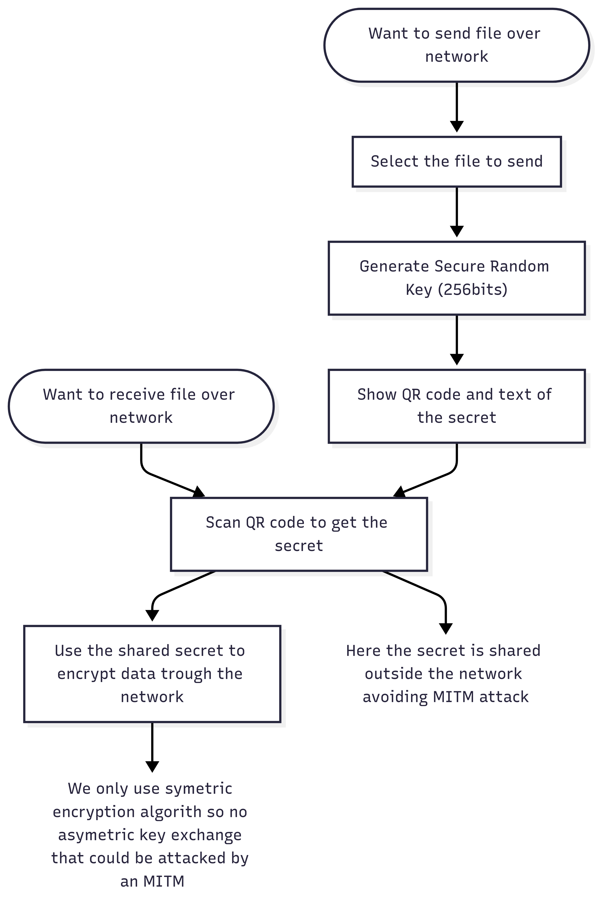
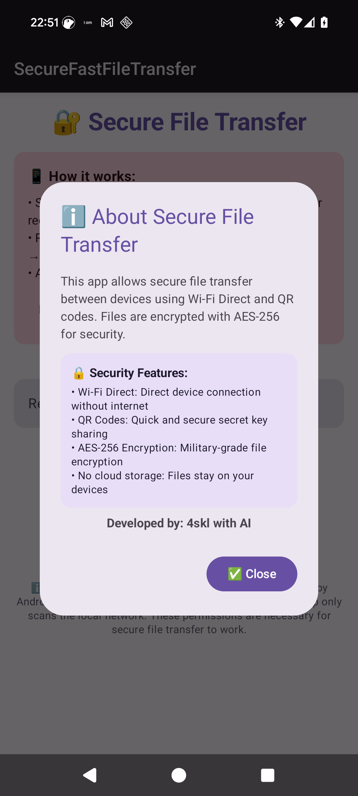

# ⚠️ Should work but not reviewed yet; this is a prototype  

# 🔐 SecureFastFileTransfer  

Android application for transferring files between devices on the same local network using **AES-256 encryption** with QR code-based secret sharing.

## 💡 The idea



## 🎥 Demo  

**Video demonstration showing the file transfer process between two Android devices:**  
*note that in this demo, the transfer speed is slow cause using a buffer bigger than 1 MB, this have been fixed and I'm working on making this app multiplatform*

[Video demonstration showing the file transfer process between two Android devices](https://github.com/user-attachments/assets/866e1859-77c7-4974-8b6b-01abe0321eec)



## 🌟 Features

### 🔒 Security First
- **AES-256-GCM encryption** with PBKDF2 key derivation (310,000 iterations)
- **UUID-based secrets** shared via QR codes or manual entry
- **MITM-resistant**: Files are encrypted end-to-end before transmission
- **No cloud storage**: All transfers happen locally on your network

### ⚡ Fast & Efficient
- **Local WiFi transfer** for maximum speed
- **Streaming encryption/decryption** for large files
- **Real-time progress tracking** with transfer speed monitoring
- **Background processing** with Android services

### 📱 User-Friendly
- **Material Design 3** UI with intuitive interface
- **QR code generation** for easy secret sharing
- **QR code scanning** with camera integration
- **Manual secret entry** as backup option
- **Comprehensive error handling** and user feedback

## 🛡️ Security Architecture

### Encryption Details
- **Algorithm**: AES-256 in Galois/Counter Mode (GCM)
- **Key Derivation**: PBKDF2-SHA256 with 310,000 iterations (OWASP 2023 recommendation)
- **Initialization Vector**: 96-bit random IV per file
- **Authentication**: 128-bit authentication tag for integrity verification
- **Secret Format**: UUID (128-bit entropy) for cryptographic strength

### Security Against MITM Attacks
The app provides strong protection against Man-in-the-Middle attacks through:

1. **Pre-shared secrets**: The encryption key is shared out-of-band via QR codes
2. **End-to-end encryption**: Files are encrypted before leaving the sender's device
3. **Authenticated encryption**: GCM mode provides both confidentiality and authenticity
4. **Secret verification**: Both devices verify the secret before file transfer begins

## 🚀 How It Works

### For Senders:
1. 📁 **Select File**: Choose any file from your device
2. 🔑 **Generate Secret**: App creates a secure UUID-based encryption key
3. 📱 **Share QR Code**: Display QR code for the receiver to scan
4. ✅ **Confirm Transfer**: Verify connection and start encrypted transfer

### For Receivers:
1. 📂 **Select Directory**: Choose where to save received files
2. 📷 **Scan QR Code**: Scan the sender's QR code (or enter secret manually)
3. 🔗 **Connect**: App connects to sender using the shared secret
4. 📥 **Receive File**: File is transferred and decrypted automatically

## 🔧 Technical Stack

- **Language**: Kotlin
- **UI Framework**: Jetpack Compose with Material Design 3
- **Encryption**: Java Cryptography Architecture (JCA)
- **QR Codes**: ZXing library
- **Network**: Standard Java sockets over WiFi
- **Architecture**: MVVM with Android Services
- **Min SDK**: Android 5.0 (API 21) - supports 99% of devices

## 📋 Permissions

The app requires the following permissions:

### Essential Permissions:
- **Camera**: For QR code scanning
- **Storage**: For reading files to send and saving received files
- **Network**: For WiFi communication between devices

### Location Permissions:
- Required by Android for WiFi scanning and peer discovery
- Used only for local network device discovery
- No location data is collected or transmitted

## 🏗️ Project Structure

```
app/src/main/java/com/skl/securefastfiletransfer/
├── MainActivity.kt              # Main UI and user interactions
├── CryptoHelper.kt             # AES-256 encryption/decryption
├── WiFiTransferHelper.kt       # Network discovery and handshake
├── FileTransferService.kt      # Background file transfer service
├── QRCodeHelper.kt            # QR code generation and validation
└── WifiDirectHelper.kt        # WiFi Direct support (alternative)
```

## 🛠️ Building the Project

### Prerequisites
- Android Studio Hedgehog or newer
- Android SDK 21+ 
- Kotlin 1.9+

### Build Steps
1. Clone the repository:
   ```bash
   git clone https://github.com/4skl/SecureFastFileTransfer.git
   ```

2. Open in Android Studio

3. Sync Gradle dependencies

4. Build and run:
   ```bash
   ./gradlew assembleDebug
   ```

## 📱 Installation

### From Source
1. Build the project (see above)
2. Install the APK on both devices:
   ```bash
   adb install app/build/outputs/apk/debug/app-debug.apk
   ```

### Requirements
- **Android 5.0+** (API level 21 or higher)
- **WiFi connection** (both devices on same network)
- **Camera** (for QR code scanning)
- **Storage access** (for file operations)

## 🤝 Usage Instructions

### First Time Setup
1. **Install** the app on both devices
2. **Grant permissions** when prompted (camera, storage, location)
3. **Connect both devices** to the same WiFi network

### Transferring Files
1. **On Sender Device**:
   - Tap "📤 Send File" 
   - Select file to transfer
   - Share QR code with receiver

2. **On Receiver Device**:
   - Tap "📥 Receive File"
   - Select save directory
   - Scan sender's QR code
   - Confirm to start transfer

3. **Both Devices**:
   - Verify secret codes match
   - Confirm transfer to begin
   - Monitor progress until completion

## ⚡ Performance

- **Encryption Speed**: ~50-100 MB/s (device dependent)
- **Network Speed**: Limited by WiFi (typically 10-50 MB/s)
- **Memory Usage**: Minimal - streaming encryption prevents memory buildup
- **Battery Impact**: Low - optimized background processing

## 🔍 Troubleshooting

### Common Issues

**Connection Failed**:
- Ensure both devices are on the same WiFi network
- Check that WiFi scanning permissions are granted
- Restart the app if connection timeouts occur

**QR Code Scanning Issues**:
- Ensure camera permission is granted
- Try manual secret entry as alternative
- Check lighting conditions for QR scanning

**Transfer Failures**:
- Verify secret codes match exactly
- Ensure sufficient storage space on receiver
- Check that files aren't corrupted

### Network Requirements
- Both devices must be on the **same WiFi network**
- **WiFi scanning** must be enabled
- Some enterprise networks may block peer-to-peer connections

## 🛡️ Security Considerations

### Best Practices
- **Verify QR codes** are scanned from trusted devices only
- **Use on trusted networks** (avoid public WiFi for sensitive files)
- **Check file integrity** after transfer completion
- **Clear app data** after transferring sensitive documents

### Limitations
- **Network security**: App inherits security properties of the underlying WiFi network
- **Physical security**: QR codes should be shared securely (not photographed by others)
- **Device security**: Ensure both devices are free from malware

## 📜 License

This project is dual-licensed:

### Code License
The source code is licensed under the **MIT License** - see the [LICENSE](LICENSE) file for details.

### Documentation and Media License
The documentation, screenshots, videos, and other media assets are licensed under the **Creative Commons Attribution 4.0 International License (CC BY 4.0)**.

[](http://creativecommons.org/licenses/by/4.0/)

**You are free to:**
- **Share** — copy and redistribute the material in any medium or format
- **Adapt** — remix, transform, and build upon the material for any purpose, even commercially

**Under the following terms:**
- **Attribution** — You must give appropriate credit, provide a link to the license, and indicate if changes were made. You may do so in any reasonable manner, but not in any way that suggests the licensor endorses you or your use.

This means you can freely use the documentation, demo videos, and screenshots in your own projects with proper attribution.

## 👨‍💻 Author

**4skl** - *Developer*
- Developed with AI assistance
- GitHub: [@4skl](https://github.com/4skl)

## 🙏 Acknowledgments

- **Android Jetpack Compose** team for the modern UI framework
- **ZXing** project for QR code functionality  
- **Material Design** team for design guidelines
- **OpenSSL/BoringSSL** contributors for cryptographic foundations

## 📞 Support

For issues, questions, or contributions:
- **GitHub Issues**: [Create an issue](https://github.com/4skl/SecureFastFileTransfer/issues)
- **Documentation**: Check this README and inline code comments
- **Security Reports**: Please report security vulnerabilities privately

---

**⚠️ Security Notice**: This app provides strong encryption for file transfers, but overall security depends on proper usage and network security. Always verify the identity of devices you're transferring files to/from.
